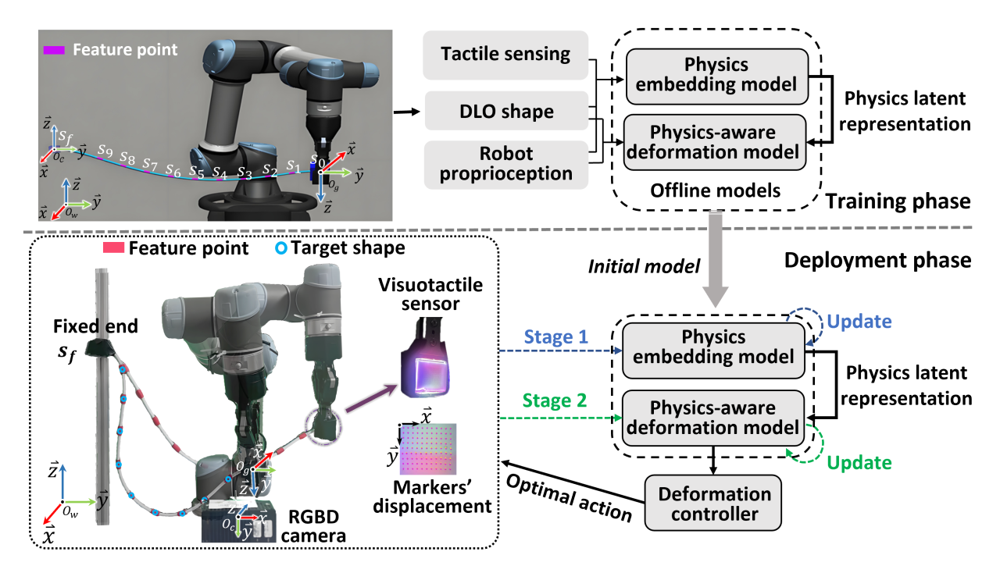

# PA-DLOS
## __Learning Physics-Aware Sensorimotor Model with Visuotactile Sensing for Deformable Linear Objects Manipulation__

💡 We are working on an learning physics-aware sensorimotor model for shape control of Deformable Linear Objects (DLOs) with unknown physical properties. The paper has been submitted to _IEEE Robotics and Automation Letters (RAL)_, and we plan to open-source the code after the paper is accepted.

🎥 __Check out our demonstration video on [YouTube](https://youtu.be/MitYT1SDTe4):__

## Paper abstract
Abstract—Learning accurate sensorimotor modele between robot motion and shape deformation of Deformable Linear Objects (DLOs) remains challenging, especially for those with unknown physical properties. This letter presents the Physics-Aware Deformable Linear Object Shaping (PA-DLOS) framework, which enables shape control of such DLOs. Specifically, the proposed global neural network-based DLO deformation model, trained in simulation, is conditioned on physics embeddings that are estimated in real time by a visuotactile-based multimodal model. On this basis, precise shape servoing of unseen DLOs can be achieved via a dual-stage online optimization strategy, which modulates the simulation-trained deformation model according to online visual and tactile feedback. Extensive simulations and real-world experiments demonstrate that PADLOS outperforms representative data-driven methods in both DLO deformation modeling and shape control.Trained solely in simulation, our framework achieves a 100% success rate and the highest accuracy in real-world shape servoing tasks.
