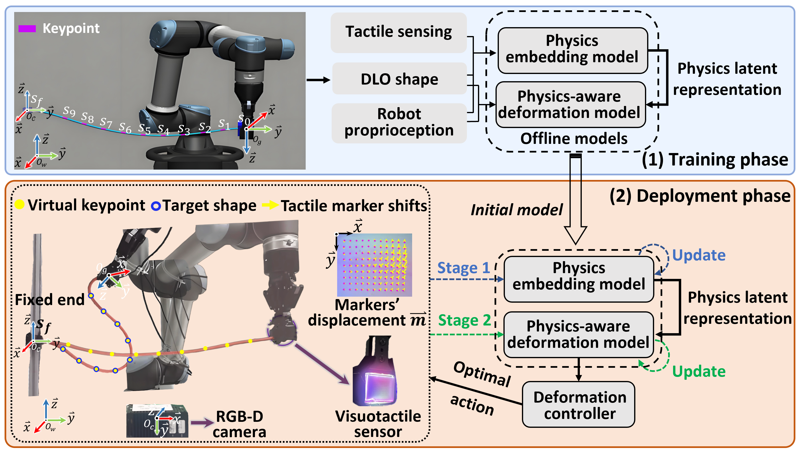

# PA-DLOS
## __Learning Physics-Aware Sensorimotor Model with Visuotactile Sensing for Deformable Linear Objects Manipulation__

💡 We are working on an learning physics-aware sensorimotor model for shape control of Deformable Linear Objects (DLOs) with unknown physical properties. The paper has been submitted to _IEEE/ASME Transactions on Mechatronics_.
[](10.1109/TMECH.2026.3678745)
[](https://ieeexplore.ieee.org/document/11482717)

## 📢 News

* **[2026.03]** 🎉 Our paper on DLO shape control has been accepted by _IEEE/ASME Transactions on Mechatronics_.

## 📢 录用证明 (Acceptance Proof)
为方便 CSC 专家审核，相关证明材料已整理至 [proof](./proof) 文件夹：

* [1. 官网录用状态查询结果](./proof/官网录取结果.png)
* [2. TMECH 录用邮件截图](./proof/录用邮件.png)
* [3. 论文首页预览](./proof/论文首页.png)

## 🎥 __The vedio of extensive robotic experiments could be found at [here](https://youtu.be/UIX6jxIGCQo)🔗:__

[](https://youtu.be/UIX6jxIGCQo)

## Paper abstract
Abstract—Learning accurate sensorimotor modele between robot motion and shape deformation of Deformable Linear Objects (DLOs) remains challenging, especially for those with unknown physical properties. This letter presents the Physics-Aware Deformable Linear Object Shaping (PA-DLOS) framework, which enables shape control of such DLOs. Specifically, the proposed global neural network-based DLO deformation model, trained in simulation, is conditioned on physics embeddings that are estimated in real time by a visuotactile-based multimodal model. On this basis, precise shape servoing of unseen DLOs can be achieved via a dual-stage online optimization strategy, which modulates the simulation-trained deformation model according to online visual and tactile feedback. Extensive simulations and real-world experiments demonstrate that PADLOS outperforms representative data-driven methods in both DLO deformation modeling and shape control.Trained solely in simulation, our framework achieves a 100% success rate and the highest accuracy in real-world shape servoing tasks.

## Requirements
The code has been tested under
* **Operating System**: Ubuntu 20.04
* **GPU**: NVIDIA GeForce RTX 1080Ti (Driver supports CUDA 12.2)
* **Python**: 3.9+ 
* **PyTorch**: 2.2.1 + cu118
* **robosuite**: 1.4.1

## Environment Setup
### Setup anaconda environment
```
$ conda create --name PAdlos python=3.9 -y
$ conda activate PAdlos
$ pip install -r /path/to/your/requirements.txt
```

## Dataset Preparation

* dataset_PA-DLOS_shapeServoing: Click [here](https://drive.google.com/file/d/1jLNyHDJ2GUI4cBReho7q9QLDlHap3KHe/view?usp=sharing)

### Dataset Format Definition

The combined data vector is a **236-dimension** representation, structured as follows:

#### **I. Physical & Static Properties (0~6)**
* **0**: The length of the DLO.
* **1**: The thickness (diameter). (Placeholder, not used in our algorithm)
* **2**: The mass. (Placeholder, not used in our algorithm)
* **3**: The bending stiffness. (Placeholder, not used in our algorithm)
* **4~6**: The position of the fixed point (3).

#### **II. State Input (7~43)**
* **7~36**: The positions of the 10 feature points ($10 \times 3$).
* **37~43**: The pose of the end-effector.
  * Position (3) + Orientation in quaternion (4).

#### **III. Action / Control Input (44~79)**
* **44~73**: The velocities of the 10 feature points ($10 \times 3$).
* **74~79**: The velocities of the end-effector.
  * Linear velocity (3) + Angular velocity (3).
  * *Note: The unit of angular velocity is normalized by $2\pi$ rad/s.*

#### **IV. History Buffer (80~235)**
* **80~87**: Tactile marker displacements of the previous 4 frames ($4 \times 2$).
* **88~115**: End-effector poses of the previous 4 frames ($4 \times 7$).
* **116~235**: Feature point positions of the previous 4 frames ($4 \times 30$).
